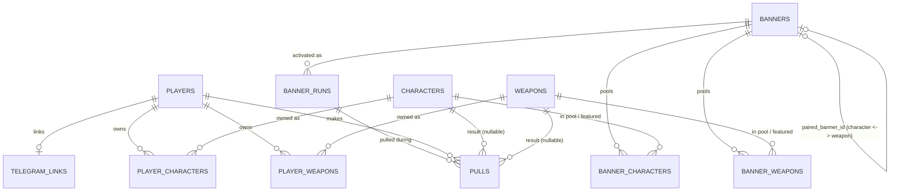

# Architecture

## Overview

A Python Telegram bot providing a gacha game for a private friend group.
Players collect real anime characters (and, from Phase 1.2, weapons),
pulled from **standard** (permanent) and **event** (rotating, rate-up)
banners using a currency they earn for free, with genre-standard pity
mechanics. From Phase 1.1, an admin web panel curates that content
(characters, weapons, banners) instead of it being seeded by a script.
See `CLAUDE.md` for repo layout and coding conventions, `GACHA.md` for
pull mechanics, and `MECHANICS.md` for the game entities and economy;
this doc covers the system design.

```
                                  ┌───────────────────────────────────────────┐
                                  │                moscow VPS                  │
                                  │  ┌──────────┐ ┌─────────┐ ┌─────────────┐ │
Telegram  ◄── proxy ──────────────┼──┤   bot    │─┤ mariadb │ │  keycloak   │ │
 servers      (helsinki)          │  │(container)│ │(container)│(container, │ │
                                  │  └──────────┘ └─────────┘ │ pre-existing)│ │
                                  │        │                   └─────────────┘ │
                                  │        │ shares services/+models/          │
                                  │  ┌─────▼────┐                              │
      admin panel ◄── Traefik ────┼──┤   api    │  (Phase 1.1, FastAPI,       │
      (browser, OIDC login)      │  │(container)│   serves admin/'s static    │
                                  │  └──────────┘   build too)                 │
                                  │   docker compose network                   │
                                  └───────────────────────────────────────────┘
```

## Infrastructure

- **Host:** internal alias `moscow` (see the ops vault for the actual
  hostname/credentials) — chosen for its RAM headroom, since a
  containerized MariaDB needs more than a small 1GB box comfortably offers.
- **Docker Compose stack:**
  - `bot` — built from the repo `Dockerfile` (uv-based Python image).
  - `mariadb` — official `mariadb:11` image, data in a named volume. Not
    installed on the host — deliberately containerized like everything else
    deployed to these VPSes.
  - `api` (Phase 1.1) — the *same* image as `bot`, run via a
    docker-compose `command:` override (`uvicorn ley_shards_bot.api:app`)
    rather than a second `Dockerfile` — see "Admin Panel" below.
- **Telegram connectivity:** `moscow` has no direct route to
  `api.telegram.org`. The bot routes *all* Telegram API traffic — both
  `getUpdates` long-polling and outgoing `send*` calls — through another
  internal host's (`helsinki`) tinyproxy
  (`http://<user>:<pass>@<proxy-host>:<proxy-port>`), configured on
  `ApplicationBuilder`'s `proxy` and `get_updates_proxy`. Real
  hostname/port/credentials are documented in the ops vault, not here.
- **Traefik** (already running on `moscow`, `v3.7`) is the reverse proxy
  for every web-facing service there — ports 80/443, Let's Encrypt via
  the `letsencrypt` cert resolver, Docker-label-based routing, services
  join an external `proxy` network. The `api` service (Phase 1.1) joins
  that same pattern: `traefik.enable=true`,
  `traefik.http.routers.<name>.rule=Host(\`<subdomain>.<domain>\`)`,
  `.tls.certresolver=letsencrypt` — no new reverse-proxy infra needed,
  just labels plus a DNS record. Exact subdomain TBD when that ticket is
  picked up.
- **Keycloak** (already running on `moscow`, `26.7.1`, its own Postgres)
  is what the admin panel authenticates against (Phase 1.1) — not a new
  password system. A realm role (e.g. `gacha-admin`) gates panel access;
  authorization is entirely Keycloak-side, so adding more admins later is
  a Keycloak-console action, not a code change.

## Component boundaries

```
commands/        →  services/  →  models/
commands/helpers/   (game rules)  (persistence)
(Telegram)                ▲
                          │
                        api/  (Phase 1.1, FastAPI — same services/models/,
                               different front door)
```

- **`commands/`** — one module per Telegram command (or small group of
  closely related commands, e.g. `gacha.py` holds both `/pull` and
  `/pull10`). Parses the `Update`, calls into `services/`, formats the
  reply. No game rules live here. Every function that ends in `_command`
  (or is registered as a `CommandHandler`/`CallbackQueryHandler`/
  `MessageHandler` in `app.py`) lives in one of these files — nothing
  else does.
- **`commands/helpers/`** — Telegram-aware plumbing that more than one
  command file needs, but that isn't itself a command: chat-type/
  permission checks (`scoping.py`), resolving which player a command
  targets (`targeting.py`), formatting constants shared across replies
  (`formatting.py`), and the command-menu data shared by `/` autocomplete
  and `/help` (`menu.py`). Nothing in this package registers a handler in
  `app.py`. The test for "does this belong in `commands/helpers/` instead
  of a plain `commands/*.py` file" is simple: does it get used by more
  than one command module, or does it not correspond to an actual
  `/command` at all? Either one means `helpers/`, not the flat directory.
- **`services/`** — the game logic, framework-agnostic (no
  `python-telegram-bot` imports). This is what unit tests target, and
  what both `commands/` and (from Phase 1.1) `api/` call into — one
  source of truth for gacha/economy rules shared between the bot and the
  web panel, not two parallel implementations. Mostly one module per
  domain (`gacha.py`, `economy.py`, `roster.py`), but a concept that
  isn't owned by any single domain gets its own shared module instead of
  living inside whichever domain happened to need it first — e.g.
  `players.py` (a player's Telegram identity and its lookup, used by both
  `gacha.py` and `economy.py`) and `pagination.py` (paging any sequence,
  used by `collection.py` today and by Phase 1.1's `/banners`/admin-panel
  listings later). If you're about to add a function or type to a
  domain's `services/` module and it doesn't actually reference that
  domain's rules (no pity/rarity math in it, no currency amounts, no
  roster fields), that's the sign it belongs in a shared module instead —
  see "Before adding something new" below.
- **`models/`** — SQLAlchemy ORM models, one module per table/aggregate.
  Columns and relationships only — if a model file needs a method beyond
  what SQLAlchemy itself generates, that logic belongs in `services/`
  instead.
- **`api/`** (Phase 1.1) — FastAPI routes for the admin panel: one
  handler per endpoint, parses the request, calls into `services/`,
  returns a Pydantic response model. Validates Keycloak-issued OIDC
  tokens against Keycloak's JWKS endpoint. Mirrors `commands/`'s job for
  a different transport, and follows the same rule — no game rules live
  here either.

This separation exists so pity math, RNG weighting, and balance changes can
be tested as plain Python without a Telegram update, an HTTP request, or a
live DB.

### Before adding something new

When a change introduces a genuinely new file, module, enum, or shared
concept — not just a function added to an existing, already-scoped file —
its placement gets discussed and decided explicitly before writing code,
and this section gets updated with the decision. The alternative is how
`commands/helpers/`, `services/pagination.py`, and the move of `PlayerRef`
into `services/players.py` all came to be needed in the first place: each
one was originally dropped into whichever file happened to need it first
(`economy.py`, `collection.py`, `gacha.py`), not because it belonged
there, and it took a dedicated audit
([#58](https://github.com/sm-steel/ley-shards-bot/issues/58)) to notice
and fix it. Deciding placement up front is cheaper than an audit later.

A quick way to sanity-check a placement decision before committing to it:
does the new code reference the domain it's about to live in? A rule that
touches pity counters or rarity weights belongs in `services/gacha.py`; a
permission check or a value object with no game-rule content in it almost
certainly doesn't belong in any single domain's file.

## Data model



| Table | Status | Purpose |
|---|---|---|
| `players` | Implemented; grows columns | Telegram user id, `username` (opportunistically captured), Ley Shards balance, Echoes balance, `last_daily_claimed_at`, `last_trickle_date`. Phase 1.1 adds `standard_tickets`/`event_tickets`, `timezone` (nullable, self-reported — see #43), and `registered_at` (nullable — set once `/start` completes; distinct from row existence, since admin-targeted rows can exist unregistered, see "Registration gate" above); Phase 1.2 adds `weapon_tickets` — see `MECHANICS.md`'s Currencies table. |
| `characters` | Implemented; grows columns | Name, series, image URL, `description` (Phase 1.1), tags (Phase 1.1, simple JSON/text), rarity (3★/4★/5★, admin-editable from Phase 1.2), `role`/`element` (Phase 1.2, enums), placeholder base stats (HP/ATK/DEF/SPD, admin-editable from Phase 1.2) — see `MECHANICS.md`'s Characters section. |
| `weapons` | Planned (Phase 1.2) | Mirrors `characters`' shape but admin-authored, not AniList-sourced: name, image URL, rarity, `weapon_type` enum, placeholder base stats. |
| `player_characters` | Implemented; reinterpreted | Ownership: `(player_id, character_id, copies_owned)`. `copies_owned` is now **constellation progress** (0–6, capped at 7 total copies), not a raw duplicate count — see `GACHA.md`'s "Duplicates" section for the pull-time logic and `MECHANICS.md` for what constellations are. |
| `player_weapons` | Planned (Phase 1.2) | Ownership, mirrors `player_characters`: `copies_owned` is **refinement progress** (1–5, first copy already refinement 1). |
| `banners` | Implemented; restructured (Phase 1.1) | The reusable **definition**: `type` (standard/event/weapon), name, rate-up character/weapon pick(s), `paired_banner_id` (self-referential, nullable — links an event character banner definition to its paired event weapon banner definition, Phase 1.2). Never deleted when a banner ends. |
| `banner_runs` | Planned (Phase 1.1) | One row per **activation**: `banner_id` FK, `starts_at`, `ends_at` (nullable while live). Rerunning a banner is a new row against the same `banners.id` — zero re-curation. The standard banner gets one permanent run. |
| `banner_characters` | Planned (Phase 1.1) | `(banner_id, character_id, is_featured)` — a banner's character pool. `is_featured` marks the two rate-up 4★ and two rate-up 3★ on an event banner (meaningless — always false — on the standard banner). Replaces today's implicit "standard banner = every character in the DB." |
| `banner_weapons` | Planned (Phase 1.2) | Mirrors `banner_characters` for weapons. |
| `pity_state` | Implemented | `(player_id, banner_type)` → current pull count + `guaranteed_rate_up` flag. Standard, event-character, and (Phase 1.2) event-weapon pity are tracked separately, keyed by banner **type** — see `GACHA.md`'s "Pity never resets" section for why that matters. |
| `pulls` | Implemented; column renamed (Phase 1.1) | History log for auditing pity/RNG correctness, not shown to players directly today (Phase 1.3's Telegram Web App is the intended player-facing surface — see its own section in the roadmap). `banner_id` becomes `banner_run_id` — a pull points at which specific *run* it happened during, not just which definition. Phase 1.2 adds a nullable `weapon_id` alongside the existing `character_id` (a pull result is one or the other, never both). |
| `telegram_links` | Planned (Phase 1.1) | `(keycloak_subject unique, telegram_user_id FK, linked_at)` — general-purpose Keycloak-subject-to-Telegram-user mapping, not admin-specific. See "Admin Panel" below. |
| `link_codes` | Planned (Phase 1.1) | Short-TTL one-time codes for the linking flow (bot and API are separate processes, so this is their DB-backed handoff). |

## Currencies and pull mechanics

Both moved out of this doc as the game grew — see `MECHANICS.md` for
currencies (Ley Shards, Echoes, banner tickets) and character/weapon
entity attributes, and `GACHA.md` for pull costs, pity, banners, and the
character/weapon mixed pool.

## Character roster

**Content creation has exactly one path: the admin API — no code may
write to `characters` or `weapons` outside it.**

Today (Phase 1), an admin-only ingestion command bulk-fetches
characters from the **AniList GraphQL API**, ranks them by `favourites`,
and buckets them into rarity by percentile (top slice → 5★, next → 4★,
rest → 3★) — straight to the DB, bypassing any admin API since none
exists yet.

From Phase 1.1, that whole pipeline is retired, not kept alongside the
new one. Adding a character becomes a curated, one-at-a-time admin action
through the panel: search AniList by name, see results with
photo/description/tags, pick one, and set its rarity **explicitly** (no
more auto-computed-by-percentile) — that save goes through the same admin
API a human uses, so there's a single write path. Characters already
seeded by the old bulk run aren't required to be deleted (test data), but
`scripts/ingest_roster.py` itself is retired once the new flow lands.
Weapons (Phase 1.2) are admin-authored from the start — there's no
external data source for them, so they only ever go through the panel.

## Admin Panel (Phase 1.1)

- **`src/ley_shards_bot/api/`** — a FastAPI service in the *same* package
  as the bot (see "Component boundaries" above), run via a docker-compose
  `command:` override on the `bot` image rather than a second
  `Dockerfile`. Validates Keycloak-issued OIDC tokens against Keycloak's
  JWKS endpoint; a realm role (`gacha-admin`) gates access.
- **`admin/`** — a Vite + TypeScript + React frontend, using
  **shadcn/ui** as *the* UI component library for all web work (docs:
  https://ui.shadcn.com/docs) rather than ad-hoc or a second component
  library, with **biome** for lint/format/import-sorting (a separate
  toolchain from the Python side's `uv`/`ruff` — see `CLAUDE.md`). The
  shadcn/ui Claude Code skill (https://ui.shadcn.com/docs/skills) is
  installed in `admin/` once `components.json` exists there, so generated
  component code follows the project's actual setup. Built to static
  assets and served directly by `api` (`StaticFiles` mount) — one
  container to route via Traefik, not a second nginx container.
- **Typed API contract, generated, not hand-maintained.** FastAPI
  produces an OpenAPI schema from the route/Pydantic-model definitions
  for free; a repo script exports it, and `openapi-typescript` (or
  `orval`) generates `admin/`'s TS API client/types from it — the
  frontend never hand-writes request/response types that quietly drift
  from the backend. Wired into the frontend build so drift gets caught.
- **Telegram account linking** is a **general-purpose** mechanism, not
  admin-only — any Keycloak-authenticated user can link their Telegram
  identity (`telegram_links`), so a future player-facing panel can reuse
  it unchanged. Self-service: the panel generates a one-time `link_codes`
  entry for the logged-in Keycloak user, they DM `/link_telegram <code>`
  to the bot, the bot records the mapping. Decoupled from panel
  authorization (that's the Keycloak role) — linking is purely about
  connecting identities, used for attribution and any Telegram-aware
  panel feature later.
- **Traefik + DNS**, same pattern as Keycloak's existing routing — see
  "Infrastructure" above.

## Commands & topics (Phase 1.1: DM-first)

Today (Phase 1), `/pull`/`/pull10` are scoped to the group's dedicated
**"🎰 Gacha"** topic (`_in_gacha_topic` in `commands/gacha.py`, via
`message_thread_id`); `/daily`/`/collection` aren't topic-restricted but
were designed with the group in mind.

From Phase 1.1, the interaction model flips:

- **Player commands** (`/daily`, `/pull`, `/pull10`, `/collection`,
  `/banners`, `/banner_info`, `/link_telegram`, `/buy_ticket`) work via
  **1-to-1 DM with the bot** — `_in_gacha_topic`'s group-topic check is
  replaced with a DM check (`update.effective_chat.type == "private"`),
  inverting which context is required rather than just relaxing it.
- **Rare-pull group announcement**: when a DM pull lands 4★ or better
  (character or, from Phase 1.2, weapon), the bot also posts a public
  celebratory message into the group's 🎰 Gacha topic (e.g. "🎉 Aleksey
  just pulled a ★★★★★ Frieren!"), on top of — not instead of — the
  private DM result. Needs a new `GROUP_CHAT_ID` config value: the bot
  currently only knows `GACHA_TOPIC_ID`, meaningless on its own once
  pulls happen in DM rather than *in* the chat that config value is
  relative to.
- **Admin commands** (`/grant`, `/revoke`, `/award_guess`) work in
  **both** DM and the group, same as today (never topic-scoped) — this
  phase adds explicit test coverage for both contexts rather than
  leaving it incidental.

### Registration gate

**A player must register (`/start`) before they can do anything else in
the game — this is mandatory, not optional onboarding.** Today (Phase 1)
a `players` row is created silently and implicitly, the first time
*any* economy/gacha function happens to touch that `telegram_user_id`
(`get_or_create_player()`, see `services/players.py`). From Phase 1.1,
every player-initiated command instead requires the player to have
completed `/start` first — `/daily`, `/pull`, `/pull10`, `/collection`,
the first-message trickle, and any later player-facing command
(`/banners`, `/buy_ticket`, `/set_timezone`, ...) all check this and
reply telling the player to `/start` first if it hasn't happened yet,
rather than silently creating a player and proceeding. `/start` is what
captures timezone (see #43) and is where any other future
onboarding-time question would be asked, once — not re-asked per
command.

This needs a real distinction that doesn't exist today: a `players` row
existing is not the same thing as a player being *registered*.
Row-without-registration must stay possible, because admin-initiated
targeting already relies on it (issues #12/#13): replying to someone
with `/grant` or `/award_guess` creates/credits their row even if
they've never touched the bot themselves, and that has to keep working
— an admin can still pre-grant currency to someone who hasn't run
`/start` yet. So: add a nullable `players.registered_at: datetime`
(`None` until `/start` completes), and gate only on that — not on row
existence. Admin commands (`/grant`, `/revoke`, `/award_guess`) targeting
another player never require the *target* to be registered; only the
*caller* of a player-initiated command needs `registered_at is not
None`.

Open question for whoever picks up #43: does the passive trickle bonus
(today, silent, fires on any group message) also require registration,
or is it exempt as "not a deliberate action"? Leaning toward gating it
too, for consistency (no player should accumulate Ley Shards before
they've registered) — confirm this when the ticket is implemented.

## Roadmap (explicitly out of scope for Phase 1.1/1.2)

- **Combat:** turn-based system using pulled characters' (and weapons')
  stored base stats. Own design pass once this phase is validated in the
  test group.
- **Story:** narrative framing for banners/events, deeper chapter content.
  Own design pass, likely alongside or after combat.
- **Skills, passives, weapon effects, and what constellations/refinement
  levels actually grant** are all Phase 2's job, once combat design
  exists. Phase 1.1/1.2's schema work is shaped so none of this is
  awkward to add later:
  - `characters.base_hp`/`base_atk`/`base_def`/`base_spd` (and, Phase
    1.2, `weapons`' equivalents) stay plain scalar columns, not a JSON
    blob — skills/passives/effects become their own additive tables
    (`character_skills`, `character_passives`, `weapon_effects`),
    FK'd to `characters`/`weapons`, not a restructuring of the base
    tables.
  - `characters.anilist_id` and (Phase 1.2) `weapons.id` stay stable,
    boring primary keys those future FKs can point at without churn.
  - Constellations/refinement (Phase 1.1/1.2 — see `GACHA.md`'s
    "Duplicates" section and `MECHANICS.md`'s Characters/Weapons
    sections) only build the **level counter**
    (`player_characters`/`player_weapons.copies_owned`, reinterpreted,
    no new column) now. What each level *grants* is a natural fit for a
    future `character_constellations` (`character_id`, `level` 1–6,
    effect description/data) and `weapon_refinements` equivalent —
    additive tables, not something guessed at or half-built now.
- **Telegram Web App (Phase 1.3):** a player-facing view (current
  banners, full balances, pull history) inside Telegram itself, using
  Telegram's own `initData` auth. Not designed yet — needs its own
  research pass first. See the Phase 1.3 GitHub milestone for current
  scope.

## Testing strategy

- **Unit tests** (`tests/`, mirrors `src/` layout): `services/`+`models/`
  tests cover pity/RNG statistical simulation (thousands of simulated
  pulls per banner type confirming rates converge and pity actually
  forces a 5★ by the hard-pity pull), economy balance math, and roster
  rarity bucketing. `commands/` tests are thin-layer — topic/DM scoping,
  error-to-reply mapping, that a successful action produces the right
  reply — not a second copy of the game-math tests.
- **`api/` tests** (Phase 1.1): route-level tests against `services/`
  the same way `commands/` tests do today, plus auth tests (token
  validation, role gating).
- **`admin/` verification** (Phase 1.1): `biome check` + frontend build —
  see `CLAUDE.md` for the exact commands once the frontend is scaffolded.
- **Manual end-to-end**: a throwaway test bot + empty test group (topics
  enabled, matching "🎰 Gacha" topic) before anything touches the real
  group. See `README.md` for the deploy commands used there.
