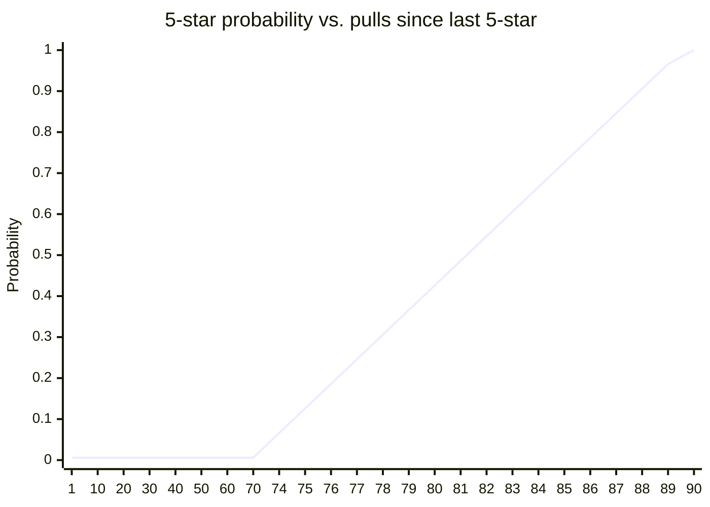
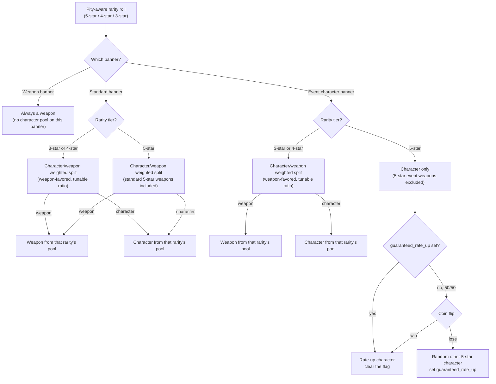

# Gacha Pull Mechanics

This is the authoritative doc for pull mechanics specifically: costs,
pity, banners, and the character/weapon mixed pool. It covers the full
target design across Phase 1, 1.1, and 1.2 — not just what's implemented
today — so each row below is marked with its status. See `ARCHITECTURE.md`
for how the system is built and `MECHANICS.md` for the game *entities*
(characters, weapons) this doc's rolls actually produce.

## Status

| Feature | Status |
|---|---|
| Single/10-pull, standard banner, pity, event 50/50 | **Implemented** (Phase 1) |
| Standard banner content curation (`banner_characters`) | Planned (Phase 1.1) |
| Banner selection (`/banners`, `/pull <banner>`) | Planned (Phase 1.1) |
| Banner tickets — standard/event (pre-purchased pull currency) | Planned (Phase 1.1) |
| Weapons, weapon banner, character/weapon mixed pool | Planned (Phase 1.2) |
| Banner ticket — weapon | Planned (Phase 1.2) |

## Pull costs

- **Single pull:** 160 Ley Shards, or one matching banner ticket if the
  player has one (tickets preferred automatically — see below).
- **10-pull:** 1600 Ley Shards (no discount, just convenience), guaranteed
  ≥ one 4★-or-better among the ten. This guarantee needs no special
  batch logic — see "Why the 10-pull guarantee needs no extra code" below.

### Banner tickets (planned, Phase 1.1; weapon ticket adds in Phase 1.2)

Players can pre-buy pull currency instead of always spending Ley Shards
directly at pull time — mirrors Genshin's Fates. Three kinds, **not**
interchangeable — each pays for its own banner category only:

- **Standard ticket** — pays for a standard-banner pull only. (Phase 1.1)
- **Event ticket** — pays for the current event-*character*-banner pull
  only. (Phase 1.1)
- **Weapon ticket** — pays for the paired event-*weapon*-banner pull only.
  (Phase 1.2, since the weapon banner itself doesn't exist until then.)

All three cost 160 Ley Shards each via
`/buy_ticket <standard|event|weapon> <count>` — the same as a direct
single pull, just paid in advance. `/pull` automatically spends a
matching ticket for whichever banner it's targeting if the player has
one, falling back to direct Ley Shards otherwise; no extra prompt.

## Banners

| Banner | Lifetime | Pool | Rate-up |
|---|---|---|---|
| **Standard** | Permanent | Curated character pool (Phase 1.1) + standard-pool weapons (Phase 1.2) | None |
| **Event (character)** | One active at a time | Standard character pool + one admin-picked rate-up character | Classic 50/50 |
| **Event (weapon)** | Paired 1:1 with the active event-character banner, same lifetime | Weapons only (no characters) | Rate-up on the featured weapon(s), details TBD when Phase 1.2's weapon-banner ticket is picked up |

Today (Phase 1), only the standard banner exists in practice — the engine
already supports an event banner's rate-up/50/50 mechanics, but nothing
creates one yet (that's Phase 1.1's admin panel). The weapon banner
doesn't exist until Phase 1.2.

## Pity

Genshin-shaped, tracked per player per **banner type** (not per specific
banner instance).

- **5★:** base rate 0.6%. Soft pity starts ramping at pull 74 (+6
  percentage points per pull past that), hard pity (guaranteed) at pull
  90.
- **4★:** base rate 13%, hard-guaranteed at least once every 10 pulls
  (a 5★ also counts as "4★ or better" and resets this counter too).

### Pity never resets — it's always safe to pull

Because pity is keyed by **banner type**, not by which specific banner
happens to be running, a player's pity counter **carries over untouched**
when one event banner ends and the next one begins — for *both* the
event-character banner and its paired event-weapon banner. Nothing about
switching to a new event ever zeroes anyone's progress.

Concretely: if a player is sitting at 60 pulls into their event-character
pity when that banner rotates out, they start the *next* event character
banner already at 60, not 0 — same for event-weapon pity, independently.
(Only landing an actual 5★ resets its own counter, exactly as it always
has — that's normal pity, not a rotation penalty.)

This is a deliberate player-safety guarantee, not an incidental side
effect of how `pity_state` happens to be keyed: **a player can never
"lose" Ley Shards, tickets, or progress by pulling on an event banner**
just because it might rotate out before they hit their 5★. Pity spent
now is never wasted spend later.

Flat at the base rate through pull 73, then the soft-pity ramp kicks in at
74, reaching the pull-90 hard-pity wall.

### Why the 10-pull guarantee needs no extra code

The "10-pull guarantees ≥ one 4★+" rule isn't a separate batch check —
it's an emergent property of the continuous 4★ pity counter. Because that
counter forces a 4★-or-better at least once every 10 pulls *no matter
where it started*, ten sequential single pulls through the same engine
already satisfy the guarantee on their own. Verified by simulation in
`tests/services/test_gacha.py`.

## Event banner: the 50/50

On an event *character* banner, a 5★ pull is always a character (see the
mixed-pool section below — 5★ event weapons simply aren't in this
banner's pool). Which character is the classic coin flip:

- If the player's `guaranteed_rate_up` flag is set (they lost the 50/50
  last time), this 5★ is **always** the rate-up character, and the flag
  clears.
- Otherwise, 50/50: rate-up character, or a random other 5★ character
  from the standard pool. Losing sets `guaranteed_rate_up` for the
  banner's *next* 5★.

## The roll, step by step

The 4★ pity guarantee can be satisfied by either a character or a weapon
(matches real Genshin — no separate character/weapon 4★ pity to track).
The 5★ guarantee is always a character on a character banner — trivially
true, since 5★ event weapons aren't in that banner's pool to begin with.

## Character/weapon mixed pool (planned, Phase 1.2)

Within a rolled rarity tier, weapons are pulled *much* more often than
characters — exact weighting is a tunable constant (proposed default
80/20 favoring weapons), decided when that ticket is picked up. The tiers
where this split even applies differ by banner (see the flowchart above):

- **Standard banner:** every rarity tier (3★/4★/5★) mixes characters and
  weapons.
- **Event character banner:** only 3★/4★ mix; 5★ is character-only (event
  weapons are on the paired weapon banner instead).
- **Weapon banner:** no split — everything is a weapon.

## Duplicates → Echoes

A duplicate pull (character or, from Phase 1.2, weapon) converts into a
secondary currency, **Echoes**, scaled by rarity, instead of granting a
second copy. Echoes are banked for a future ascension/combat system —
see `MECHANICS.md`. This keeps Ley Shards a meaningful sink rather than a
system where every pull after the first copy is a refund.
