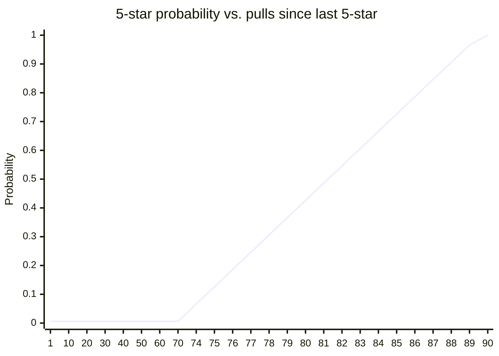
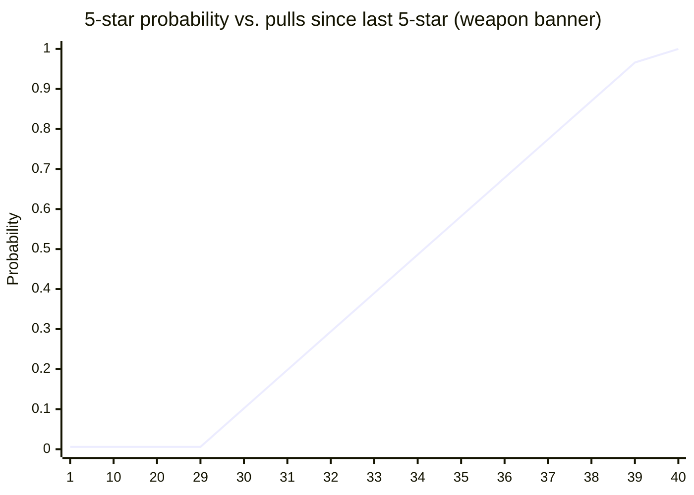
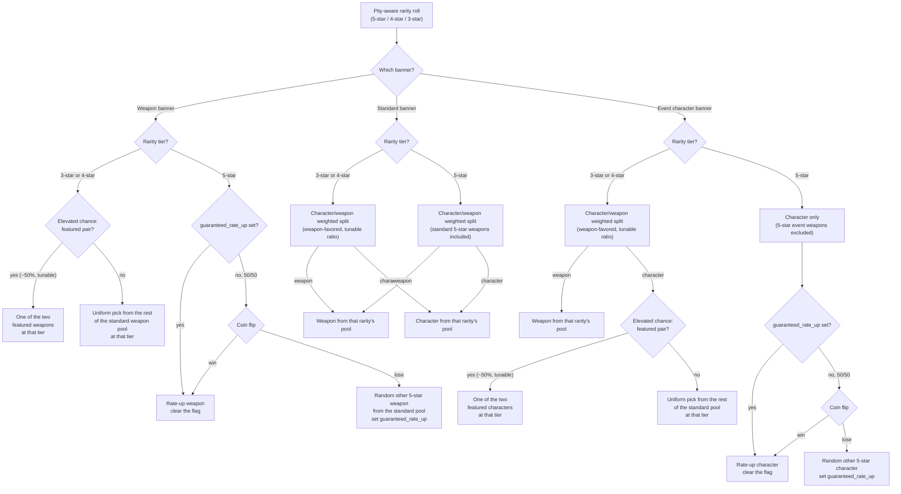

# Gacha Pull Mechanics

This is the authoritative doc for pull mechanics specifically: costs,
pity, banners, and the character/weapon mixed pool. It covers the full
target design across Phase 1, 1.1, and 1.2 — not just what's implemented
today — so each row below is marked with its status. See `ARCHITECTURE.md`
for how the system is built and `MECHANICS.md` for the game *entities*
(characters, weapons) this doc's rolls actually produce.

## Status

| Feature | Status |
|---|---|
| Single/10-pull, standard banner, pity, event 50/50 | **Implemented** (Phase 1) |
| Standard banner content curation (`banner_characters`) | Planned (Phase 1.1) |
| Banner selection (`/banners`, `/pull <banner>`) | Planned (Phase 1.1) |
| Banner tickets — standard/event (pre-purchased pull currency) | **Implemented*** (Phase 1.1) |
| Weapons, weapon banner, character/weapon mixed pool | Planned (Phase 1.2) |
| Banner ticket — weapon | Planned (Phase 1.2) |

\* `/pull`/`/pull10`'s automatic ticket-spend only checks the standard
ticket today, since both commands always operate on the standard
banner until #32 adds banner selection. Event tickets are purchasable
via `/buy_ticket` but nothing spends them yet.

## Pull costs

- **Single pull:** one matching banner ticket if the player has one —
  spent instantly, no prompt. Otherwise, 160 Ley Shards **with an explicit
  confirmation step first** — see below.
- **10-pull:** ten matching tickets, or a mix of tickets plus Ley Shards
  for whatever the tickets don't cover (also confirmed first — see
  below), 160 Ley Shards-equivalent per pull not covered by a ticket.
  Guaranteed ≥ one 4★-or-better among the ten either way. This guarantee
  needs no special batch logic — see "Why the 10-pull guarantee needs no
  extra code" below.

### Banner tickets (planned, Phase 1.1; weapon ticket adds in Phase 1.2)

Players can pre-buy pull currency instead of always spending Ley Shards
directly at pull time — mirrors Genshin's Fates. Three kinds, **not**
interchangeable — each pays for its own banner category only:

- **Standard ticket** — pays for a standard-banner pull only. (Phase 1.1)
- **Event ticket** — pays for the current event-*character*-banner pull
  only. (Phase 1.1)
- **Weapon ticket** — pays for the paired event-*weapon*-banner pull only.
  (Phase 1.2, since the weapon banner itself doesn't exist until then.)

All three cost 160 Ley Shards each via
`/buy_ticket <standard|event|weapon> <count>` — the same as a direct
single pull, just paid in advance.

**Spending a ticket is instant; spending Ley Shards directly always asks
first.** `/pull`/`/pull10` spend an existing matching ticket automatically (today, that's always the standard ticket — see the Status table's footnote above) — that Ley Shards commitment already happened when the ticket was
bought, so there's nothing left to confirm. But whenever a pull would
draw on Ley Shards *directly* — no matching ticket at all for a single
pull, or not enough tickets to cover every pull in a 10-pull — the bot
shows an explicit confirm/cancel prompt before spending anything,
framed as converting that Ley Shards amount into the ticket(s) needed to
complete the pull. Ley Shards are the general-purpose base currency and
may pick up other uses later (a future Phase 2 system, say) — locking
some of it into a single-banner-type ticket is a real choice for the
player to make, not something to spend on their behalf silently. For a
10-pull with some tickets already in hand, the prompt only covers the
*shortfall* (e.g. 4 tickets owned + 6 needed = spend the 4 instantly,
confirm converting Ley Shards for the other 6), not the whole batch.

## Banners

| Banner | Lifetime | Pool | Rate-up |
|---|---|---|---|
| **Standard** | Permanent | Curated character pool (Phase 1.1) + standard-pool weapons (Phase 1.2) | None |
| **Event (character)** | One active at a time | Standard character pool + one admin-picked 5★ rate-up + two featured 4★ + two featured 3★ | Classic 50/50 (5★); elevated-chance featured pair (4★/3★, see below) |
| **Event (weapon)** | Paired 1:1 with the active event-character banner, same lifetime | Weapons only (no characters) + one 5★ rate-up weapon + two featured 4★ + two featured 3★ | Classic 50/50 (5★, same shape as the character banner); elevated-chance featured pair (4★/3★, see below) |

**Banners are reusable — they're built to be rerun, not just recreated.**
An admin's curation work (which character is 5★ rate-up, which four are
the featured 4★/3★ pairs — same for a weapon banner) is a **banner
definition**, saved independently from any specific time window it's
live. Ending a banner doesn't discard that curation: rerunning it later
reuses the exact same definition, no re-picking characters from scratch.
An event character banner and its paired event weapon banner are linked
at the *definition* level too, so rerunning one is meant to bring its
paired counterpart back with it, not leave it behind. (Schema-level
detail — separate "banner definition" vs. "banner run" tables, and how
the pairing is represented — lives in `ARCHITECTURE.md`, since this is a
data-modeling concern more than a pull-mechanics one; noted here because
it directly affects what a rerun means for players: none of your
context about "that banner had X and Y featured" ever goes stale.)

Today (Phase 1), only the standard banner exists in practice — the engine
already supports an event banner's rate-up/50/50 mechanics, but nothing
creates one yet (that's Phase 1.1's admin panel). The weapon banner
doesn't exist until Phase 1.2.

## Pity

Genshin-shaped, tracked per player per **banner type** (not per specific
banner instance). The weapon banner has its own, shorter thresholds —
see below — everything else (standard and event-character banners)
shares these numbers:

- **5★:** base rate 0.6%. Soft pity starts ramping at pull 74 (+6
  percentage points per pull past that), hard pity (guaranteed) at pull
  90.
- **4★:** base rate 13%, hard-guaranteed at least once every 10 pulls
  (a 5★ also counts as "4★ or better" and resets this counter too).

### Pity never resets — it's always safe to pull

Because pity is keyed by **banner type**, not by which specific banner
happens to be running, a player's pity counter **carries over untouched**
when one event banner ends and the next one begins — for *both* the
event-character banner and its paired event-weapon banner. Nothing about
switching to a new event ever zeroes anyone's progress.

Concretely: if a player is sitting at 60 pulls into their event-character
pity when that banner rotates out, they start the *next* event character
banner already at 60, not 0 — same for event-weapon pity, independently.
(Only landing an actual 5★ resets its own counter, exactly as it always
has — that's normal pity, not a rotation penalty.)

This is a deliberate player-safety guarantee, not an incidental side
effect of how `pity_state` happens to be keyed: **a player can never
"lose" Ley Shards, tickets, or progress by pulling on an event banner**
just because it might rotate out before they hit their 5★. Pity spent
now is never wasted spend later.

Flat at the base rate through pull 73, then the soft-pity ramp kicks in at
74, reaching the pull-90 hard-pity wall.

### Weapon banner pity: shorter thresholds, same shape

Same base rate (0.6%) and the same ramp *mechanic*, but the weapon
banner's numbers are deliberately tighter — soft pity starts ramping at
pull **30**, hard pity (guaranteed) at pull **40**:

Flat at the base rate through pull 29, then the soft-pity ramp kicks in
at 30, reaching the pull-40 hard-pity wall — same proportional shape as
the character/standard chart above (the ramp reaches ~96.6% by the pull
before hard pity, same as that one does at pull 89), just compressed
into a much shorter run, per the "weapon banner should be easier to
pull" decision. Exact numbers (30/40, and the base rate) are tunable
constants like everything else here, decided when that ticket is picked
up.

### Why the 10-pull guarantee needs no extra code

The "10-pull guarantees ≥ one 4★+" rule isn't a separate batch check —
it's an emergent property of the continuous 4★ pity counter. Because that
counter forces a 4★-or-better at least once every 10 pulls *no matter
where it started*, ten sequential single pulls through the same engine
already satisfy the guarantee on their own. Verified by simulation in
`tests/services/test_gacha.py`.

## Event banner: rate-up mechanics

Every event banner — character *and* weapon — has rate-up at every rarity
it offers, not just 5★. The two banners follow the same shape; only the
5★ mechanic differs between them.

### Event character banner

**5★ — the classic 50/50.** A 5★ pull here is always a character (see
the mixed-pool section below — 5★ event weapons simply aren't in this
banner's pool). Which character is the coin flip:

- If the player's `guaranteed_rate_up` flag is set (they lost the 50/50
  last time), this 5★ is **always** the rate-up character, and the flag
  clears.
- Otherwise, 50/50: rate-up character, or a random other 5★ character
  from the standard pool. Losing sets `guaranteed_rate_up` for the
  banner's *next* 5★.

**4★ and 3★ — featured pairs.** Two featured 4★ characters and two
featured 3★ characters, picked by the admin alongside the 5★ rate-up —
not a coin flip, an elevated *chance* stacked on top of the ordinary
standard pool at that tier. When a roll lands on "character" at 4★ or 3★
(see the mixed-pool split below):

- With an elevated combined probability (proposed default 50%, split
  evenly — 25% each — between the two featured characters; exact number
  tunable, decided when this ticket is picked up), the pull is one of
  that tier's two featured characters.
- Otherwise, it's a uniform pick from the rest of the standard pool at
  that tier (the two featured characters excluded from that "rest" pool,
  so they aren't double-weighted).

No pity/guarantee interaction for the featured pairs — unlike the 5★
50/50, there's no "lost last time, guaranteed next time" flag, just a
flat elevated draw chance every time.

### Event weapon banner

Exactly the character banner's shape, weapons instead of characters —
same 50/50-with-guarantee at 5★, same featured pairs at 4★/3★, same
`guaranteed_rate_up` flag and pity semantics, tracked via `pity_state`
for `BannerType.WEAPON` the same way the character banner uses
`BannerType.EVENT`. No epitomized-path-style pick-your-own mechanic —
that option's dropped in favor of reusing the exact character-banner
logic wholesale.

**5★ — the classic 50/50.** A 5★ pull here is always a weapon (this
banner has no character pool at all):

- If the player's `guaranteed_rate_up` flag is set (they lost the 50/50
  last time, on *this* banner type), this 5★ is **always** the rate-up
  weapon, and the flag clears.
- Otherwise, 50/50: rate-up weapon, or a random other 5★ weapon from the
  **standard** pool (the same standard 5★ weapons that also appear on
  the standard banner — see the Banners table). Losing sets
  `guaranteed_rate_up` for the banner's *next* 5★.

**4★ and 3★ — featured pairs.** Same shape as the character banner: two
featured 4★ weapons and two featured 3★ weapons with an elevated chance
over the rest of the standard weapon pool at that tier, no guarantee
flag.

### Standard banner

None of the above applies — every character or weapon at a given rarity
is a uniform pick from the whole pool, no featured/rate-up concept at
all. Only event banners have rate-up, at any tier.

## The roll, step by step

The 4★ pity guarantee (on standard/event-character banners) can be
satisfied by either a character or a weapon (matches real Genshin — no
separate character/weapon 4★ pity to track). The 5★ guarantee is always
a character on a character banner and always a weapon on the weapon
banner — trivially true in both cases, since each banner's pool only
ever contains the one or the other at 5★.

## Character/weapon mixed pool (planned, Phase 1.2)

Within a rolled rarity tier, weapons are pulled *much* more often than
characters — exact weighting is a tunable constant (proposed default
80/20 favoring weapons), decided when that ticket is picked up. The tiers
where this split even applies differ by banner (see the flowchart above):

- **Standard banner:** every rarity tier (3★/4★/5★) mixes characters and
  weapons.
- **Event character banner:** only 3★/4★ mix; 5★ is character-only (event
  weapons are on the paired weapon banner instead).
- **Weapon banner:** no split — everything is a weapon.

## Duplicates: constellations, refinement, then Echoes

A duplicate pull doesn't just become currency — first it levels up the
character or weapon itself, up to a cap. Only once that cap is reached
does a further duplicate convert into Echoes. (This reinterprets
`copies_owned`, an already-shipped Phase 1 column — no new column, but a
real refactor of the shipped duplicate-handling logic, `PullOutcome`, and
the `/pull`/`/collection` reply text that reports it.)

### Characters: constellations (working name — final name TBD)

Every character has **6 constellation levels**. The first copy a player
pulls is the base character (constellation 0 — unlocked, unenhanced).
Each subsequent duplicate advances it one constellation level instead of
being wasted — **7 total copies** (1 base + 6 constellation levels) fully
constellates a character. Only once a player already owns that 7th copy
does another duplicate convert to Echoes, scaled by rarity as before.

**What each constellation actually grants is Phase 2's job** — passive
abilities, once combat design exists (see `ARCHITECTURE.md`'s
forward-compatibility guardrails: a future `character_constellations`-
shaped table is exactly what those levels will eventually hang off of).
This phase only needs the counter and the pull-time logic, not the
effects.

### Weapons: refinement (working name — final name TBD, Phase 1.2)

Same shape, for weapons, with Genshin's real asymmetry carried over
deliberately: a weapon's first copy already counts as **refinement rank
1** (a lone weapon is fully functional on its own — refinement enhances
it further, it doesn't unlock it), and each duplicate advances one rank
up to **refinement 5** — **5 total copies** maxes a weapon, not 7. Beyond
that, further duplicates convert to Echoes the same way. Reuses
`player_weapons.copies_owned` (1 through 5 = refinement 1 through 5) the
same way characters reuse theirs.

### Echoes, unchanged

Once a character reaches constellation 6 (7 copies) or a weapon reaches
refinement 5 (5 copies), further duplicates convert into **Echoes**,
scaled by rarity, exactly as before. Echoes are banked for a future
ascension/combat system — see `MECHANICS.md`. This keeps Ley Shards a
meaningful sink rather than a system where every pull after the first
copy is a refund — it just takes longer to reach that point now that
duplicates do something first.
